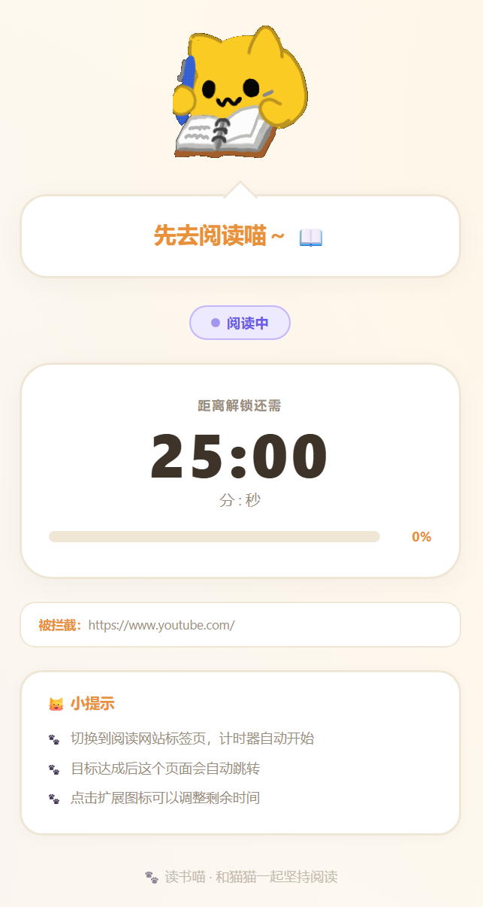
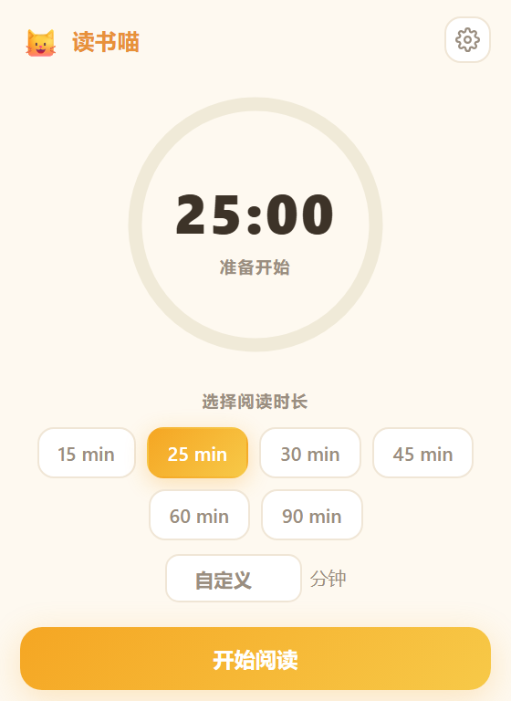
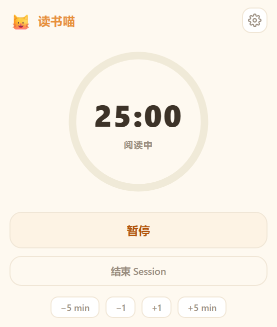
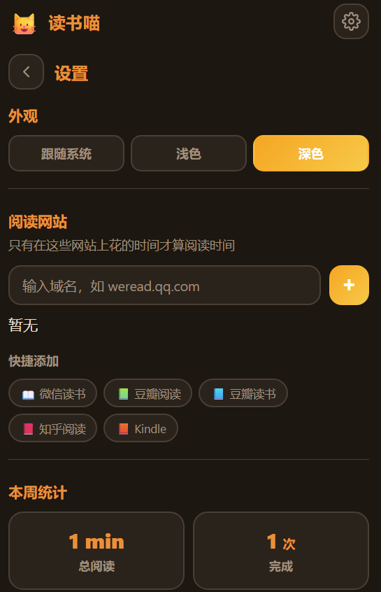
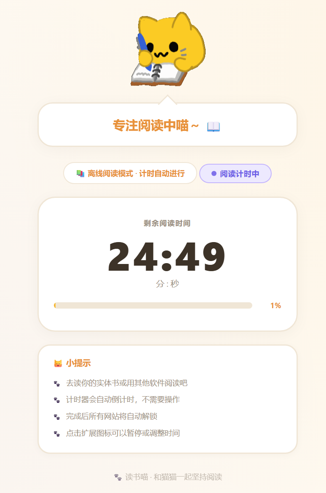

# 🐱 读书喵 | Reading Cat

**一个帮你「先读书再上网」的 Chrome 扩展。**  
**A Chrome extension that makes you read before you browse.**

设定阅读时间 → 读满才能自由浏览 → 猫猫全程陪你坚持！  
Set a reading goal → finish reading to unlock browsing → your cat companion keeps you going!

<p align="center">
  
</p>

---

## 🚀 快速开始 | Quick Start

**3 步即可使用 — Up and running in 3 steps:**

| 步骤 Step | 操作 Action |
|-----------|------------|
| **1. 安装 Install** | 下载本项目 → `chrome://extensions` → 开发者模式 → 加载已解压的扩展<br>Download this project → `chrome://extensions` → Developer mode → Load unpacked |
| **2. 设定 Set up** | 点击工具栏 🐱 → 选择阅读时长 → 开始阅读<br>Click 🐱 in toolbar → pick duration → Start Reading |
| **3. 阅读 Read** | 读满时间前，其他网站被猫猫拦截！读完自动解锁 🎉<br>All other sites blocked until you finish! Auto-unlocks when done 🎉 |

<details>
<summary>📥 <b>详细安装步骤 | Detailed Installation</b></summary>

### 下载 | Download

```bash
git clone https://github.com/sanjuroku/reading-cat.git
```

或点击页面右上角 **Code → Download ZIP** 下载并解压。  
Or click **Code → Download ZIP** at the top right of this page.

### 安装到 Chrome | Load into Chrome

1. 打开 `chrome://extensions/`
2. 打开右上角 **开发者模式 | Developer mode**
3. 点击 **加载已解压的扩展程序 | Load unpacked**
4. 选择本项目文件夹
5. ✅ 工具栏出现 🐱 图标即安装成功

### 安装到 Firefox | Load into Firefox

1. 打开 `about:debugging#/runtime/this-firefox`
2. 点击 **临时载入附加组件 | Load Temporary Add-on**
3. 选择本项目文件夹中的 `manifest.json`
4. ✅ 工具栏出现 🐱 图标即安装成功

> ⚠️ 临时加载的扩展在 Firefox 重启后会消失。如需永久安装，请通过 [AMO](https://addons.mozilla.org/) 发布或使用 Firefox Developer Edition 的 `xpinstall.signatures.required = false` 设置。  
> ⚠️ Temporarily loaded extensions are removed when Firefox restarts. For permanent installation, publish via [AMO](https://addons.mozilla.org/) or use Firefox Developer Edition with `xpinstall.signatures.required = false`.

> 💡 也支持 Edge、Brave、Arc 等所有 Chromium 浏览器，安装方式相同。  
> 💡 Also works with Edge, Brave, Arc, and any Chromium-based browser.

</details>

---

## 📖 两种模式 | Two Modes

|  | 🌐 在线阅读 Online | 📚 离线阅读 Offline |
|---|---|---|
| **适合 For** | 在网页上读书（微信读书、豆瓣等）<br>Web-based reading (Kindle, etc.) | 读实体书、用其他 App<br>Physical books or reading apps |
| **设置 Setup** | 添加阅读网站<br>Add reading sites | 不添加任何网站<br>Don't add any sites |
| **计时 Timer** | 只在阅读网站上计时<br>Counts only on reading sites | 自动倒计时<br>Counts down automatically |
| **拦截 Blocking** | 屏蔽非阅读网站<br>Blocks non-reading sites | 屏蔽所有网站<br>Blocks all sites |

> 💡 **自动切换：** 添加了阅读网站 = 在线模式，没添加 = 离线模式。  
> 💡 **Auto-switch:** Sites added = Online mode. No sites = Offline mode.

---

## ✨ 功能一览 | Features

| | 功能 Feature | 说明 Description |
|---|---|---|
| ⏱️ | **番茄钟计时 Pomodoro Timer** | 15 / 25 / 30 / 45 / 60 / 90 分钟预设或自定义<br>Preset durations or custom input |
| ⏸️ | **暂停 & 调整 Pause & Adjust** | 随时暂停/继续，±1 / ±5 分钟微调<br>Pause/resume anytime, fine-tune ±1/±5 min |
| 🚫 | **网站拦截 Site Blocking** | 猫猫拦截页，显示剩余时间和进度<br>Cute cat block page with countdown & progress |
| 📊 | **阅读统计 Reading Stats** | 本周总时长、完成次数、平均时长、连续天数<br>Weekly total, sessions, average, streak |
| 🔔 | **完成通知 Notification** | 读完弹出系统通知<br>System notification when done |
| 🌙 | **深色模式 Dark Mode** | 浅色 / 深色 / 跟随系统<br>Light / Dark / System |
| 🌍 | **中英双语 i18n** | 自动跟随系统语言<br>Auto-detects system language |
| 🐱 | **猫猫陪伴 Cat Companion** | 可爱的猫猫 GIF 全程陪你阅读<br>Adorable cat GIF mascot throughout |

---

## 🖼️ 截图 | Screenshots

<table>
<tr>
<td align="center"><b>主界面 Popup</b></td>
<td align="center"><b>计时中 Running</b></td>
<td align="center"><b>深色模式 Dark</b></td>
</tr>
<tr>
<td></td>
<td></td>
<td></td>
</tr>
</table>

<table>
<tr>
<td align="center"><b>拦截页 Blocked</b></td>
<td align="center"><b>离线计时器 Timer</b></td>
</tr>
<tr>
<td></td>
<td></td>
</tr>
</table>

---

## 🤔 常见问题 | FAQ

<details>
<summary><b>关掉浏览器再打开，计时器还在吗？| Does the timer survive a browser restart?</b></summary>

是的，Session 状态保存在 Chrome Storage 中，重启不会丢失。  
Yes — session state is persisted in Chrome Storage.

</details>

<details>
<summary><b>想临时访问被拦截的网站？| Need to visit a blocked site?</b></summary>

点击扩展图标 → 暂停或结束当前 Session。  
Click the extension icon → Pause or End the session.

</details>

<details>
<summary><b>拦截页看不到倒计时数据？| Block page shows no countdown?</b></summary>

可能是旧版缓存。去 `chrome://extensions/` 删除扩展后重新加载。  
Likely a cache issue. Remove and re-add the extension at `chrome://extensions/`.

</details>

<details>
<summary><b>支持其他浏览器吗？| Other browsers?</b></summary>

支持所有 Chromium 内核浏览器：Edge、Brave、Arc、Vivaldi 等，以及 Firefox（109+）。  
Works on any Chromium-based browser: Edge, Brave, Arc, Vivaldi, etc., and Firefox (109+).

</details>

---

## 🛠️ 技术信息 | Technical Details

<details>
<summary>点击展开 | Expand</summary>

**技术栈 | Stack**

- Chrome Extension Manifest V3
- Vanilla JavaScript（无框架 | no frameworks）
- Chrome Storage / Notifications / Alarms API
- CSS Custom Properties（主题系统 | theming）

**项目结构 | Structure**

```
├── manifest.json          # 扩展配置 Extension config
├── background.js          # 计时核心 + 拦截 Timer & blocking logic
├── popup.html / css / js  # 弹出窗口 Popup UI
├── blocked.html / js      # 拦截页 Block page
├── timer.html / js        # 离线计时页 Offline timer page
├── i18n.js                # 国际化 Internationalization
├── _locales/              # 语言包 Language packs (zh_CN, en)
├── icons/                 # 图标 + 猫猫 GIF Icons & mascot
└── content.js             # 可见性检测 Visibility detection
```

</details>

---

## 📝 更新日志 | Changelog

详见 See [CHANGELOG.md](CHANGELOG.md)

## 📄 License

[MIT](LICENSE) — 自由使用、修改和分享。Free to use, modify, and share.

---

<p align="center">
  <br>
  🐾 和猫猫一起坚持阅读 | Read with your cat 🐾
  <br><br>
  ⭐ 觉得有用？给个 Star！| Star this repo if you like it!
</p>
